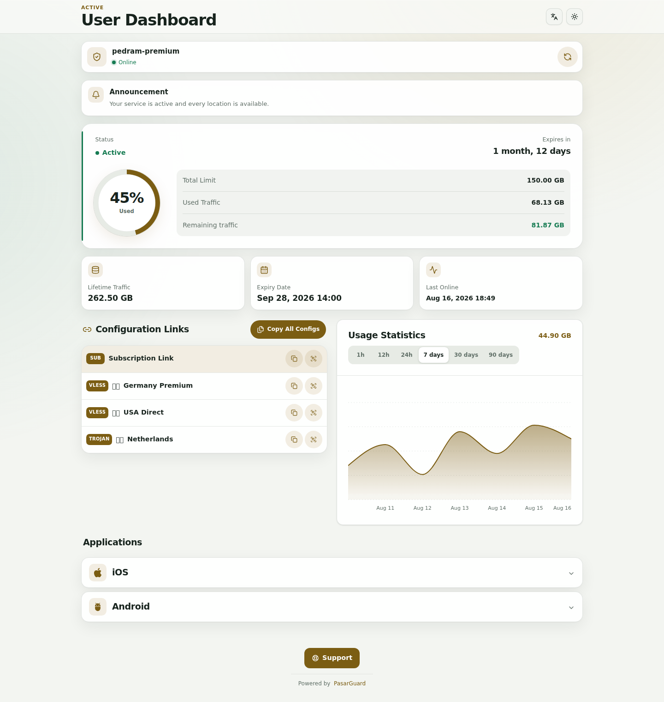

# 💎 Zomorod Template

### An emerald-and-gold subscription experience and persistent settings integration for PasarGuard

<p align="center">
  
  
  
</p>

<p align="center">
  <a href="README.md">فارسی — Primary documentation</a> ·
  <a href="docs/ARCHITECTURE.md">Architecture</a>
</p>

Zomorod is more than a replacement `index.html`. The **Special** edition combines a responsive PasarGuard subscription page with a dedicated settings control plane exposed as **Zomorod Template · Special** inside the PasarGuard dashboard.

<p align="center">
  
</p>

## Highlights

- Emerald + gold visual identity
- Persian-first UI with English, Russian and Chinese support
- Responsive subscription page, QR codes, usage analytics and application recommendations
- Standard and WireGuard configuration controls
- Native `.conf` download through PasarGuard's WireGuard endpoint
- Store-name customization
- Toggle for normal configurations, WireGuard, application list and estimated ping display
- Announcement controls with multiple daily time windows
- Native synchronization with PasarGuard subscription settings
- Self-healing dashboard integration after ordinary PasarGuard dashboard rebuilds
- No separate Zomorod database or remote management backend

> **Ping note:** the current subscription UI displays a deterministic client-side estimate, not a real ICMP/RTT measurement. The Zomorod option controls visibility of that existing estimate.

## Quick install

Run this on an existing PasarGuard server:

```bash
curl -fsSL https://raw.githubusercontent.com/PEDIHS/zomorod-template/main/install.sh | sudo bash
```

Select a language:

```bash
curl -fsSL https://raw.githubusercontent.com/PEDIHS/zomorod-template/main/install.sh | sudo bash -s -- --lang en
```

Install a tagged version:

```bash
curl -fsSL https://raw.githubusercontent.com/PEDIHS/zomorod-template/main/install.sh | sudo bash -s -- --version v4.0.0
```

Supported fallback languages: `fa`, `en`, `ru`, `zh`.

## What the installer changes

The installer:

1. backs up the existing subscription template and PasarGuard `.env`;
2. installs the Zomorod subscription page under PasarGuard's custom-template directory;
3. configures the official `CUSTOM_TEMPLATES_DIRECTORY` and `SUBSCRIPTION_PAGE_TEMPLATE` environment settings;
4. stores Zomorod-owned integration files under `/opt/zomorod` rather than modifying PasarGuard source files;
5. injects a small dashboard loader into the generated PasarGuard dashboard build;
6. installs a systemd path watcher and a periodic fallback timer to restore that loader after dashboard rebuilds;
7. restarts PasarGuard.

Key paths:

```text
/opt/zomorod/
/var/lib/pasarguard/templates/subscription/
/opt/pasarguard/.env
/etc/systemd/system/zomorod-integrator.*
```

## Shared PasarGuard settings

Zomorod does not maintain a second copy of native PasarGuard settings. The Special settings page reads and updates the existing `/api/settings` resource, including:

```text
subscription.announce
subscription.announce_url
subscription.applications
subscription.allow_browser_config
subscription.manual_sub_request.links
subscription.manual_sub_request.wireguard
```

Zomorod-specific values use a namespaced set of entries inside `subscription.response_headers`:

```text
x-zomorod-enabled
x-zomorod-store-name
x-zomorod-show-configs
x-zomorod-show-wireguard
x-zomorod-show-ping
x-zomorod-show-apps
x-zomorod-show-announcement
x-zomorod-announcement-mode
x-zomorod-announcement-times
x-zomorod-announcement-duration
```

This lets the settings travel with the PasarGuard database and its normal backup process instead of introducing another persistence layer.

## Update resilience

Zomorod intentionally avoids permanently patching PasarGuard's Python or React source tree. The owned integration payload stays in `/opt/zomorod`; a systemd watcher and timer reapply the tiny loader when the generated dashboard is rebuilt.

### Important compatibility boundary

PasarGuard currently does not expose a formal dashboard plugin API for registering third-party tabs/routes. Consequently, the dashboard tab is implemented using a **self-healing injection layer**. This is designed to survive normal application upgrades and dashboard rebuilds, but a major upstream change to the dashboard DOM, route model, authentication model or deployment paths may require a Zomorod compatibility update.

The project therefore does not claim guaranteed compatibility with arbitrary future breaking changes.

## WireGuard

The dedicated Zomorod WireGuard action requests the native PasarGuard manual subscription endpoint for `wireguard` and downloads the returned content as a `.conf` file. PasarGuard remains responsible for protocol availability, account status, permissions and HWID enforcement.

## Scheduled announcements

Set the announcement mode to `scheduled` and provide one or more local times:

```text
09:00,14:30,21:00
```

The duration value controls how long each daily window remains visible. The actual announcement text and URL remain the native PasarGuard `announce` and `announce_url` fields.

## Update

Running the installer again updates Zomorod and creates a fresh backup first:

```bash
curl -fsSL https://raw.githubusercontent.com/PEDIHS/zomorod-template/main/install.sh | sudo bash
```

Force a dashboard reintegration manually:

```bash
sudo /opt/zomorod/plugin/integrate-dashboard.sh
```

Inspect the self-healing units:

```bash
systemctl status zomorod-integrator.path
systemctl status zomorod-integrator.timer
```

## Uninstall

```bash
curl -fsSL https://raw.githubusercontent.com/PEDIHS/zomorod-template/main/uninstall.sh | sudo bash
```

The uninstaller removes Zomorod integration files but intentionally leaves PasarGuard database settings intact to avoid destructive changes to subscription configuration.

## Development

```bash
git clone https://github.com/PEDIHS/zomorod-template.git
cd zomorod-template
bun install --frozen-lockfile
bun run build
```

Syntax checks:

```bash
node --check plugin/zomorod-special.js
node --check plugin/zomorod-runtime.js
bash -n install.sh uninstall.sh plugin/integrate-dashboard.sh
```

## Project layout

```text
zomorod-template/
├── src/                         # Subscription UI
├── plugin/
│   ├── zomorod-special.js       # Dashboard settings control plane
│   ├── zomorod-runtime.js       # Subscription runtime controls
│   └── integrate-dashboard.sh   # Self-healing loader integration
├── systemd/
├── prebuilt/
├── screenshots/
├── install.sh
├── uninstall.sh
├── README.md                    # Primary Persian docs
└── README.en.md
```

## Security model

- No external Zomorod control server is installed.
- The admin token is not sent to a third-party service.
- The Special page runs on the PasarGuard origin and reuses the dashboard's existing authenticated session/token only for the native `/api/settings` call.
- PasarGuard API permissions remain authoritative.
- Zomorod-specific settings contain UI behavior flags rather than a separate set of credentials.

## Brand palette

| Role | Color |
| --- | --- |
| Emerald Deep | `#065F46` |
| Emerald | `#047857` |
| Gold Accent | `#B8860B` |
| Dark Surface | `#0B1814` |

**Zomorod Template · Built for PasarGuard**
