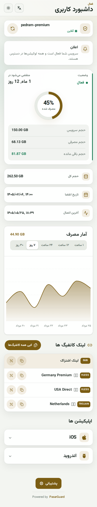

<div dir="rtl" align="right">

# 💎 زمرد — Zomorod Template

### تجربه اشتراک حرفه‌ای برای PasarGuard، با افزونه تنظیمات مستقل و ماندگار

<p align="center">
  
  
  
  
</p>

<p align="center">
  <strong>زمرد فقط یک فایل HTML نیست.</strong><br>
  این پروژه، صفحه اشتراک PasarGuard را به همراه یک لایه تنظیمات اختصاصی به نام
  <strong>«زمرد تمپلیت · Special»</strong> ارائه می‌کند؛ با تم اصلی زمردی و طلایی، تنظیمات مشترک با خود PasarGuard و مکانیزم بازگردانی خودکار Integration بعد از آپدیت پنل.
</p>

<p align="center">
  
  
</p>

<p align="center">
  <a href="README.en.md">English documentation</a> ·
  <a href="docs/ARCHITECTURE.md">معماری افزونه</a>
</p>

---

## چرا زمرد؟

نسخه اولیه این پروژه یک Subscription Template مستقل بود. در نسخه **Zomorod Special** معماری تغییر کرده است: فایل صفحه اشتراک همچنان از مکانیزم رسمی Custom Template پاسارگارد استفاده می‌کند، اما یک Control Plane جدا برای مدیریت امکانات زمرد نیز نصب می‌شود.

نتیجه این است که برای تغییر نام فروشگاه، نمایش WireGuard، اپلیکیشن‌ها، کانفیگ‌ها، اعلان و گزینه‌های دیگر لازم نیست فایل HTML را دستی ادیت کنید.

## قابلیت‌ها

### 💎 رابط کاربری زمرد

- طراحی Responsive و Mobile-first
- تم هویتی **Emerald + Gold**
- فارسی به‌عنوان زبان اصلی رابط و مستندات
- پشتیبانی از `fa`، `en`، `ru` و `zh`
- حالت روشن، تاریک و System
- QR Code، کپی کانفیگ و لینک اشتراک
- نمایش اطلاعات مصرف، تاریخ انقضا و نمودار Usage
- نمایش اپلیکیشن‌های تعریف‌شده در PasarGuard
- پشتیبانی از WireGuard و دانلود فایل `.conf`

### ⚙️ تب «زمرد تمپلیت · Special»

بعد از نصب، Integration زمرد در همان نوار تب‌های Settings پاسارگارد یک تب اختصاصی ایجاد می‌کند. از آن بخش می‌توانید:

- نام فروشگاه را تغییر دهید
- کل لایه زمرد را فعال/غیرفعال کنید
- نمایش کانفیگ‌های معمولی را روشن/خاموش کنید
- نمایش بخش WireGuard را روشن/خاموش کنید
- نمایش Ping را روشن/خاموش کنید
- بخش اپلیکیشن‌ها را روشن/خاموش کنید
- `Allow browser config` خود PasarGuard را مدیریت کنید
- فرمت `links` خود PasarGuard را فعال/غیرفعال کنید
- فرمت `wireguard` خود PasarGuard را فعال/غیرفعال کنید
- متن و لینک اعلان native پاسارگارد را تغییر دهید
- اعلان را همیشه یا در ساعت‌های مشخص نمایش دهید
- چند ساعت مختلف در روز برای نمایش اعلان تعریف کنید
- مدت فعال‌بودن هر نوبت اعلان را بر حسب دقیقه تنظیم کنید

> **نکته درباره Ping:** عدد Ping موجود در نسخه فعلی Template یک مقدار تخمینی سمت کلاینت است و ICMP/Latency واقعی اندازه‌گیری نمی‌کند. گزینه زمرد فقط نمایش آن را کنترل می‌کند.

## همگام‌سازی واقعی با PasarGuard

زمرد برای تنظیمات اصلی، دیتابیس جدا ایجاد نمی‌کند. فیلدهای native مانند:

- `subscription.announce`
- `subscription.announce_url`
- `subscription.applications`
- `subscription.allow_browser_config`
- `subscription.manual_sub_request.links`
- `subscription.manual_sub_request.wireguard`

مستقیماً از API تنظیمات خود PasarGuard خوانده و در همان‌جا ذخیره می‌شوند.

تنظیمات اختصاصی زمرد نیز در namespace زیر داخل `subscription.response_headers` پاسارگارد نگه‌داری می‌شوند:

```text
x-zomorod-enabled
x-zomorod-store-name-b64
x-zomorod-show-configs
x-zomorod-show-wireguard
x-zomorod-show-ping
x-zomorod-show-apps
x-zomorod-show-announcement
x-zomorod-announcement-mode
x-zomorod-announcement-times
x-zomorod-announcement-duration
```

نام فروشگاه به‌صورت UTF-8 Base64 ذخیره می‌شود تا مقدار Header همیشه با محدودیت Latin-1 پاسارگارد سازگار بماند؛ Runtime زمرد آن را در مرورگر decode می‌کند.

این طراحی باعث می‌شود تنظیمات زمرد با خود Backup/Database پاسارگارد همراه باشند و فایل تنظیمات مستقل دیگری برای داده‌های اصلی نیاز نباشد.

## نصب سریع

روی سروری که PasarGuard از قبل نصب است اجرا کنید:

```bash
curl -fsSL https://raw.githubusercontent.com/PEDIHS/zomorod-template/main/install.sh | sudo bash
```

زبان پیش‌فرض فارسی است. برای انتخاب زبان:

```bash
curl -fsSL https://raw.githubusercontent.com/PEDIHS/zomorod-template/main/install.sh | sudo bash -s -- --lang fa
```

نسخه مشخص:

```bash
curl -fsSL https://raw.githubusercontent.com/PEDIHS/zomorod-template/main/install.sh | sudo bash -s -- --version v4.0.0
```

مقادیر زبان:

```text
fa | en | ru | zh
```

## نصب چه کاری انجام می‌دهد؟

Installer به‌صورت خلاصه:

1. از Template و `.env` فعلی Backup می‌گیرد.
2. فایل Subscription UI زمرد را در مسیر Custom Template نصب می‌کند.
3. تنظیمات رسمی Custom Template پاسارگارد را در `/opt/pasarguard/.env` تنظیم می‌کند.
4. فایل‌های افزونه را خارج از سورس PasarGuard در `/opt/zomorod` قرار می‌دهد.
5. اسکریپت سبک Integration را به Build داشبورد متصل می‌کند.
6. یک `systemd.path` و یک Timer پشتیبان نصب می‌کند تا بعد از بازسازی Dashboard، Integration دوباره اعمال شود.
7. PasarGuard را Restart می‌کند.

مسیرهای اصلی:

```text
/opt/zomorod/                                  # فایل‌های افزونه زمرد
/var/lib/pasarguard/templates/subscription/    # صفحه اشتراک
/opt/pasarguard/.env                           # تنظیم رسمی Custom Template
/etc/systemd/system/zomorod-integrator.*       # Self-healing integration
```

## مقاومت در برابر آپدیت PasarGuard

زمرد عمداً سورس Python یا React اصلی PasarGuard را Fork یا Patch دائمی نمی‌کند. فایل‌های اصلی افزونه در `/opt/zomorod` قرار دارند و تنظیمات در Database خود PasarGuard ذخیره می‌شوند.

پس از آپدیت و Build مجدد Dashboard، سرویس `zomorod-integrator` Loader کوچک زمرد را دوباره به فایل Build متصل می‌کند. Timer نیز هر چند دقیقه یک بار سلامت Integration را بررسی می‌کند و فقط در صورت نیاز فایل‌ها را تغییر می‌دهد.

### محدودیت مهم

در ساختار فعلی PasarGuard یک Plugin API رسمی برای اضافه‌کردن Route/Tab به Dashboard وجود ندارد. بنابراین بخش Dashboard زمرد با **self-healing injection** پیاده‌سازی شده است؛ این روش برای آپدیت‌های عادی طراحی شده، اما اگر upstream ساختار DOM، مسیر Dashboard یا مدل احراز هویت را به‌صورت اساسی تغییر دهد، ممکن است نسخه جدید زمرد لازم شود.

این محدودیت عمداً شفاف بیان شده و پروژه ادعای سازگاری تضمینی با هر تغییر breaking آینده را ندارد.

## WireGuard

زمرد از مسیر native PasarGuard برای دریافت WireGuard استفاده می‌کند و یک بخش اختصاصی دانلود فایل در صفحه اشتراک ارائه می‌دهد.

وقتی WireGuard در تنظیمات زمرد و `manual_sub_request.wireguard` پاسارگارد فعال باشد، کاربر می‌تواند فایل استاندارد `.conf` را دریافت کند. سیاست‌های دسترسی، وضعیت کاربر و HWID همچنان توسط خود PasarGuard اعمال می‌شوند.

خاموش کردن نمایش WireGuard در زمرد، هم کارت دانلود اختصاصی و هم ردیف‌های WG داخل فهرست کانفیگ‌ها را مخفی می‌کند.

## اعلان زمان‌بندی‌شده

در تب زمرد می‌توانید حالت اعلان را روی `scheduled` قرار دهید و چند ساعت تعریف کنید:

```text
09:00,14:30,21:00
```

اگر Duration را `60` بگذارید، هر اعلان از ساعت شروع خود به مدت ۶۰ دقیقه در صفحه زمرد قابل مشاهده خواهد بود. متن اصلی اعلان همچنان همان `announce` رسمی PasarGuard است.

## به‌روزرسانی زمرد

اجرای دوباره Installer آخرین نسخه را نصب می‌کند و قبل از جایگزینی فایل‌ها Backup می‌گیرد:

```bash
curl -fsSL https://raw.githubusercontent.com/PEDIHS/zomorod-template/main/install.sh | sudo bash
```

برای اجرای دستی Self-healing Integration:

```bash
sudo /opt/zomorod/plugin/integrate-dashboard.sh
```

وضعیت سرویس‌ها:

```bash
systemctl status zomorod-integrator.path
systemctl status zomorod-integrator.timer
```

## حذف افزونه

```bash
curl -fsSL https://raw.githubusercontent.com/PEDIHS/zomorod-template/main/uninstall.sh | sudo bash
```

Uninstaller فایل‌های Integration را حذف می‌کند، اما مقادیر ذخیره‌شده داخل Database PasarGuard را عمداً پاک نمی‌کند تا حذف افزونه باعث حذف ناخواسته تنظیمات اشتراک نشود.

## Build از سورس

```bash
git clone https://github.com/PEDIHS/zomorod-template.git
cd zomorod-template
bun install --frozen-lockfile
bun run build
```

برای بررسی فایل‌های افزونه:

```bash
node --check plugin/zomorod-special.js
node --check plugin/zomorod-runtime.js
bash -n install.sh uninstall.sh plugin/integrate-dashboard.sh
```

## ساختار پروژه

```text
zomorod-template/
├── src/                         # Subscription UI
├── plugin/
│   ├── zomorod-special.js       # پنل تنظیمات Special
│   ├── zomorod-runtime.js       # Runtime صفحه اشتراک
│   └── integrate-dashboard.sh   # Self-healing injector
├── systemd/                     # سرویس، path watcher و timer
├── prebuilt/                    # Build fallback
├── screenshots/
├── install.sh
├── uninstall.sh
├── README.md                    # مستندات اصلی فارسی
└── README.en.md                 # English documentation
```

## امنیت

- زمرد Backend خارجی برای کنترل پنل ایجاد نمی‌کند.
- Token ادمین به سرور ثالث ارسال نمی‌شود.
- صفحه تنظیمات Special در همان Origin پاسارگارد اجرا می‌شود و از Session/Token احراز هویت موجود Dashboard برای فراخوانی `/api/settings` استفاده می‌کند.
- Permissionهای API همچنان توسط PasarGuard اعمال می‌شوند.
- داده‌های اختصاصی زمرد در Response Headerهای تنظیمات اشتراک ذخیره می‌شوند و داده حساس مستقل ایجاد نمی‌کنند.

## سازگاری

هدف این شاخه، نسخه‌های جدید PasarGuard دارای موارد زیر است:

- Custom subscription page templates
- `/api/settings`
- subscription `response_headers`
- manual subscription formats including WireGuard
- Dashboard build served from PasarGuard

برای جزئیات فنی و علت انتخاب این معماری، [ARCHITECTURE.md](docs/ARCHITECTURE.md) را ببینید.

---

### رنگ هویت زمرد

| نقش | رنگ |
|---|---|
| Emerald Deep | `#065F46` |
| Emerald | `#047857` |
| Gold Accent | `#B8860B` |
| Dark Surface | `#0B1814` |

<p align="center"><strong>Zomorod Template · Built for PasarGuard</strong></p>

</div>
